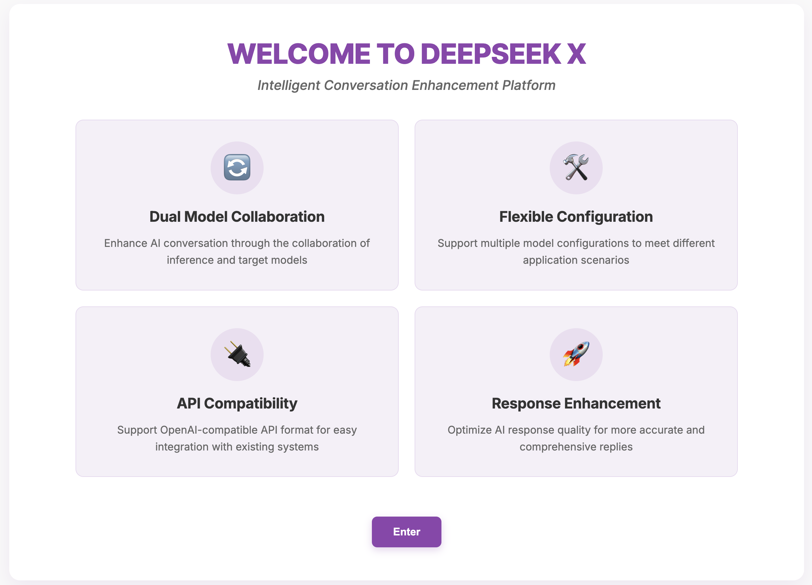
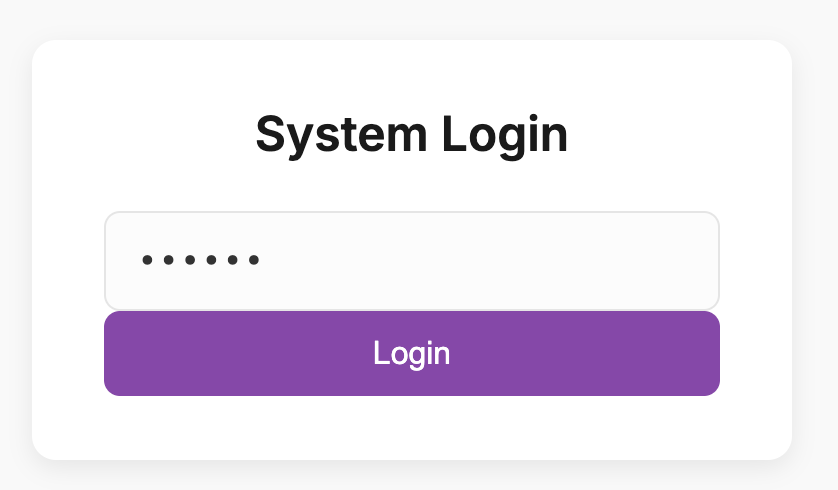
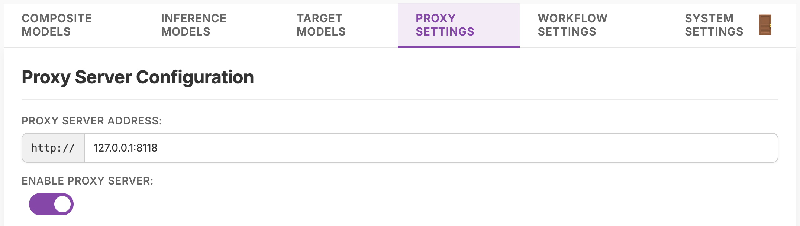
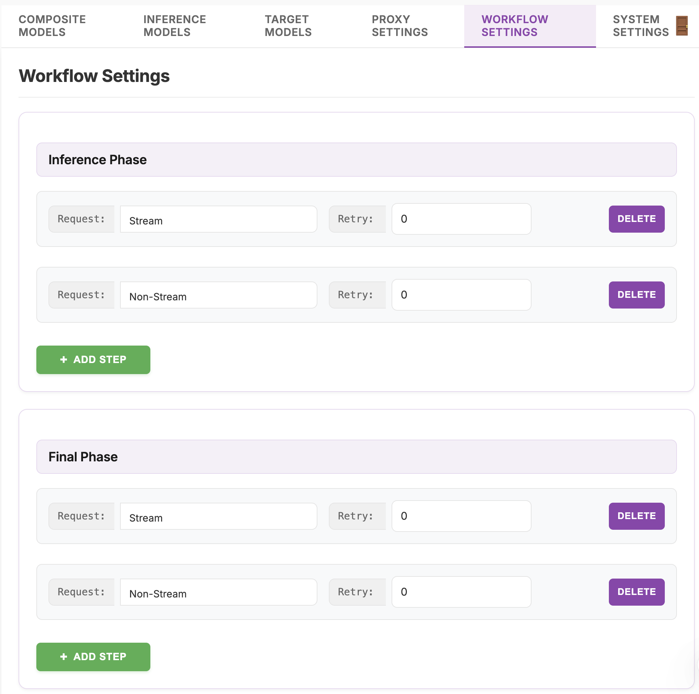

# DeepSeek-X


## Introduction

DeepSeek-X is an innovative AI agent system that cleverly combines DeepSeek's deep reasoning capabilities with Gemini or Claude(WIP)'s precise summarization abilities, implementing a two-phase collaborative workflow. The system first uses the DeepSeek model for comprehensive in-depth reasoning analysis, followed by Gemini transforming complex reasoning results into concise, clear final answers, providing users with intelligent responses that have both depth and clarity.
<div align="center">
  
</div>


## Features

- **Two-Phase Intelligent Processing Architecture**: DeepSeek handles deep reasoning, Gemini provides concise summaries, leveraging the strengths of both models
- **Streaming Real-time Responses**: Supports real-time streaming of reasoning processes and answer results, providing immediate feedback
- **Intelligent Automatic Optimization**: The system can identify effective reasoning content and automatically progress to the next phase at appropriate times, improving response efficiency
- **Flexible Configuration System**: Customize models, API keys, and proxy settings through a simple configuration file to meet different usage scenarios
- **User-Friendly Interface**: Provides an intuitive web interface for interaction and configuration management
- **Compatible Standard API**: Offers OpenAI-style compatible API interfaces for easy integration into existing systems
- **Docker Support**: Supports containerized deployment with Docker and Docker Compose


## Tutorial (Video in Chinese)
Part1: https://weixin.qq.com/sph/AfGABEeRU <br>
Part2: https://weixin.qq.com/sph/AZ4jNoXfq <br>
Part3: https://weixin.qq.com/sph/A6IuJPoXv

## Requirements

- Python 3.11 or higher
- Network connection (for accessing DeepSeek and Gemini API services)
- Valid API keys (requires API keys from DeepSeek and Google AI Studio)
- Docker and Docker Compose (for containerized deployment)

## Installation

### Quick Setup

We provide simple scripts to help you quickly set up and run:

#### Linux/macOS:

```bash
# Clone repository
git clone https://github.com/yaominghua1981/DeepSeek-X.git
cd DeepSeek-X

# Install dependencies
chmod +x setup.sh
./setup.sh

# Run service
chmod +x run.sh
./run.sh
```

#### Windows:

```bash
# Clone repository
git clone https://github.com/yaominghua1981/DeepSeek-X.git
cd DeepSeek-X

# Install dependencies
setup.bat

# Run service
run.bat
```

These scripts will automatically create a virtual environment, install all necessary dependencies, and set up the configuration file.

### Manual Installation

If you want to understand more installation details or need to customize the installation process, you can follow these steps:

#### 1. Clone repository and create virtual environment

```bash
# Clone repository
git clone https://github.com/minghuayao81/DeepSeek-X.git
cd DeepSeek-X

# Create and activate virtual environment
python -m venv venv
source venv/bin/activate  # Linux/Mac
# Or on Windows:
# venv\Scripts\activate
```

#### 2. Install dependencies

```bash
# Install core dependencies
pip install fastapi uvicorn pydantic httpx python-dotenv aiohttp sse-starlette

# Optional: Use UV tool to install dependencies (recommended, faster)
pip install uv
uv sync
```

### Docker Deployment

1. Build and run using Docker Compose:
```bash
# Build and start the container
docker-compose up --build

# To run in detached mode
docker-compose up -d --build

# To stop the container
docker-compose down
```

2. The application will be available at `http://localhost:8000`

3. Proxy Configuration:
   - If you're using a proxy, configure it in the web interface or `config.json`
   - The system will automatically handle the proxy address conversion between local and Docker environments
   - For example, if your proxy is configured as `127.0.0.1:8118`, it will be automatically converted to `host.docker.internal:8118` when running in Docker

## Configuration
### Web Interface

1. Access http://127.0.0.1:8000 in your browser
2. Log in using the `apiKey` (`123456` in default) you set in the configuration file

<div align="center">
  
</div>

3. Interact with DeepSeek-X through the interface
4. In case you need to use proxy for accessing Gemini and Claude.

<div align="center">
  
</div>

5. Flexible workflow is supported.

<div align="center">
  
</div>


## Running in Production

For production environments, it's recommended to use a more robust setup:

```bash
# Production environment startup command
uvicorn main:app --host 127.0.0.1 --port 8000
```

Production configuration notes:
- `--host 127.0.0.1`: Allow access from any IP (configure with firewall restrictions)
- `--port 8000`: Service listening port (can be changed as needed)

## Contributing

We welcome contributions to DeepSeek-X! Please feel free to submit issues or pull requests.

## Buy Me A Coffee
<div align="center">
    
</div>


## Star History

[](https://www.star-history.com/#DeepSeek-X/DeepSeek-X&Date)

## License

This project is licensed under the [MIT License](LICENSE).

## Related Links

- [DeepSeek API Documentation](https://platform.deepseek.com)
- [Google AI Studio](https://ai.google.dev/)
- [FastAPI Documentation](https://fastapi.tiangolo.com/)
- [Uvicorn Documentation](https://www.uvicorn.org/)
